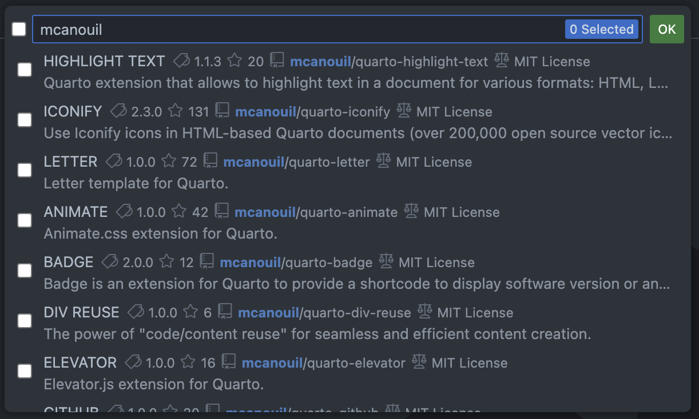

# Quarto Wizard 

## Overview

**Quarto Wizard** is a Visual Studio Code extension that helps you manage your [Quarto](https://quarto.org) projects.  
It allows you to easily install Quarto extensions directly from the [Quarto Extensions](https://github.com/mcanouil/quarto-extensions) listing repository.  
This extension provides a user-friendly interface to browse, select, and install Quarto extensions, enhancing your Quarto development experience.

## Requirements

- **Check Internet Connection**: Ensure you have an active internet connection before installing extensions.
- **Check Quarto Installation**: Verify that Quarto is installed and available in your system's PATH.

## Commands

- `Quarto Wizard: Install Extension(s)`: Opens the extension installer interface.
  - **Browse Extensions**: View a list of available Quarto extensions.  
    
  - **Install Extensions**: Install selected Quarto extensions with a single click.
- `Quarto Wizard: Clear Recently Installed Extensions`: Clears the list of recently installed extensions.
- `Quarto Wizard: Show Quarto Wizard Output`: Displays the output log for the extension installer.
- `Quarto Wizard: New Reproducible Document`: Creates a new Quarto document.
  - [`R`](/assets/templates/r.qmd)
  - [`Python`](assets/templates/python.qmd)
  - [`Julia`](assets/templates/julia.qmd)
- `Quarto Wizard: Focus on Extensions Installed View`: Opens the Quarto Wizard view to display and manage the Quarto extensions installed.

## Usage

### Install Quarto Extensions

1. Open the Command Palette (`Ctrl+Shift+P` or `Cmd+Shift+P` on macOS).
2. Type `Quarto Wizard: Install Extension(s)` and select it.
3. Browse the list of available Quarto extensions.
4. Select the Quarto extension(s) you want to install.
5. Answer the prompts to confirm the installation.

### Show Quarto Wizard Output

1. Open the Command Palette (`Ctrl+Shift+P` or `Cmd+Shift+P` on macOS).
2. Type `Quarto Wizard: Show Quarto Wizard Output` and select it.
3. View the output log for the Quarto Wizard extension.
4. Use the output log to troubleshoot any issues.

### Create a New Reproducible Document

1. Open the Command Palette (`Ctrl+Shift+P` or `Cmd+Shift+P` on macOS).
2. Type `Quarto Wizard: New Reproducible Document` and select it.
3. Choose the template for the new Quarto document.

### Manage Quarto Extensions

1. Open the Command Palette (`Ctrl+Shift+P` or `Cmd+Shift+P` on macOS).
2. Type `Quarto Wizard: Focus on Extensions Installed View` and select it.  
   Or click on the Quarto Wizard icon in the Activity Bar.


Note: Quarto extensions can only be updated if installed by Quarto Wizard (*i.e.*, if `source: <owner>/<repository>` is present in `_extension.yml`).

## Development

1. Clone the repository:

   ```sh
   git clone https://github.com/mcanouil/quarto-wizard
   ```

2. Open the project in Visual Studio Code.

3. Install the dependencies:

   ```sh
   npm install
   ```

4. Launch the extension:

   - Press `F5` to open a new VS Code window with the extension loaded.

## Contributing

Contributions are welcome! Please open an issue or submit a pull request on the [GitHub repository](https://github.com/mcanouil/quarto-wizard).

## License

This project is licensed under the MIT License.
See the [LICENSE](LICENSE) file for details.

## Disclaimer

This extension is not affiliated with or endorsed by [Quarto](https://quarto.org) or its maintainers.
