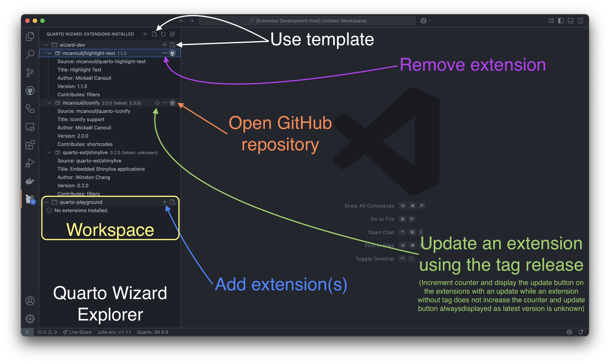

# Manage Installed Extensions

The Quarto Wizard Explorer provides a centralised view of all your installed extensions.

## Features

- **View all installed extensions** across workspace folders.
- **Check for updates** with automatic version detection.
- **Review compatibility** from `quarto-required` and extension compatibility status.
- **Inspect schema and snippets** directly from nested `Schema` and `Snippets` nodes.
- **Update extensions** with one click.
- **Remove extensions** easily.
- **Open GitHub repositories** (if source is available) and reveal extension folders in Explorer.

Click the Quarto Wizard icon in the Activity Bar to access the Explorer View.

[Open Explorer View](command:workbench.view.extension.quarto-wizard-explorer)

Extensions installed via Quarto Wizard include source tracking for seamless updates.

[Full guide](https://m.canouil.dev/quarto-wizard/getting-started/explorer-view.html)
